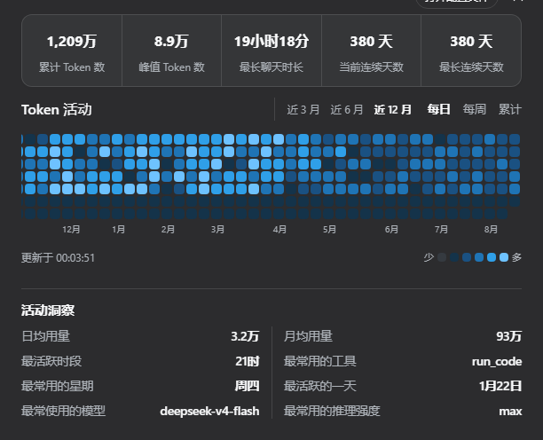
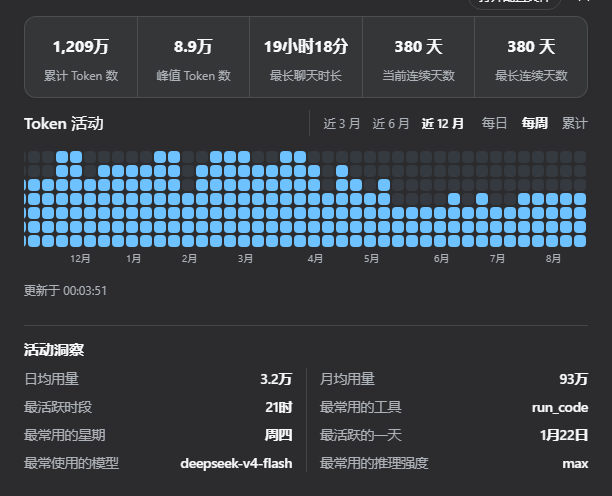
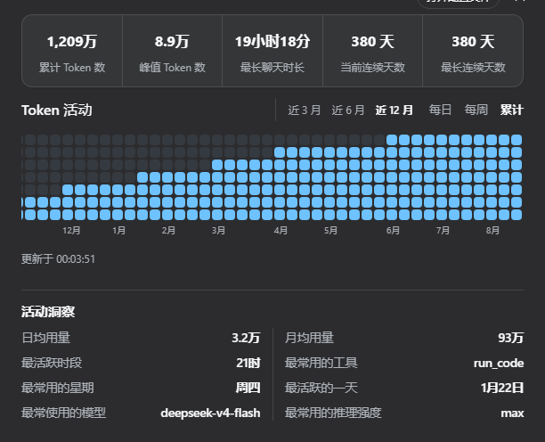
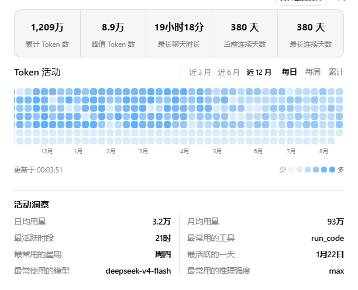

**[English](README.md) | [简体中文](README.zh.md)**

# @kelearns/dsh-token-usage

DeepSeek Harness（dsh）Web GUI 的 Token 用量热力图插件：GitHub 风格贡献图，
统计每日 / 每周 / 累计 token 用量，带汇总气泡、悬停详情与活动洞察。
通过官方插件机制（`dsh plugin add`）挂载，不修改 dsh 本体任何源码。

安装后在设置页侧边栏出现「Token 活动」入口。

## 界面预览

**每日热力图 — 深色主题、简体中文（默认 12 个月窗口）**



**三种视图 — 深色主题、简体中文**

| 每日 | 每周 | 累计 |
|:---:|:---:|:---:|
|  |  |  |

**浅色主题与英文界面**

| 浅色主题（简体中文） | Light theme (English) |
|:---:|:---:|
|  |  |

## 功能

- **汇总气泡**：单个圆角容器 + 竖线分割的 5 项统计（累计 / 峰值日 / 最长会话 / 当前连续 / 最长连续天数）；
- **三种视图**：每日（按天分级取色）、每周（周总量 ÷ (最大周/7) 得格数，底部堆叠、统一最深色）、累计（截止各周累计 ÷ (总量/7) 得格数，最新列必满 7 格）；
- **窗口切换**：近 3 / 6 / 12 个月（默认 12）；固定 12px 方格，12 个月横向滚动并自动滚到最新一周；
- **悬停详情**：「M月D日 使用了 X 个 Token」/「当周使用了 X 个 Token」/「截至 X 当周累计使用 X 个 Token」；
- **活动洞察**：最常使用的模型 / 推理强度 / 工具、最活跃时段、日均与月均用量、最常用的星期、最活跃的一天；按标签字数排序，两列等宽 + 连续中心分界线；
- **i18n**：中 / 英文，跟随文档语言实时切换；
- **主题**：浅色 / 深色双色阶，跟随 DSH 应用主题；
- **自动刷新**：每 60s 与回到前台时增量重扫变化中的会话文件；
- **跨平台**：host 半端纯 Node 标准库（`fs` / `path` / `os` / `zlib`），Windows / macOS / Linux 通用；浏览器半端与平台无关。

## 安装（官方机制）

需要 pnpm（确保在 PATH 中）：

```powershell
npm install -g pnpm
```

从 npm 安装（推荐）：

```powershell
dsh plugin --profile web add @kelearns/dsh-token-usage
```

> 已收录于 [awesome-dsh-plugin](https://github.com/awesome-dsh-plugin/awesome-dsh-plugin) 精选目录，
> 也可以在 dsh 设置页的 **Plugin Market**（[dsh-market](https://github.com/dsh-market/dsh-market)）中搜索 `token-usage` 一键安装。

本地开发安装（在仓库根目录执行，`link:.` 解析为当前目录）：

```powershell
dsh plugin --profile web add link:.
```

卸载：

```powershell
dsh plugin --profile web remove @kelearns/dsh-token-usage
```

> 安装器读取包内 `cordis.patch.yml`（`dsh.bundle.patch` 清单字段）自动应用插件行，
> 无需手写 patch。重启 dsh web 后生效。

### 手动等价方式（无 CLI 时）

1. 把包放入 profile 的 node_modules：
   `$DSH_HOME/profiles/web/node_modules/@kelearns/dsh-token-usage`；
2. 在 `$DSH_HOME/cordis.patch.yml` 追加以下块（幂等）：

```yaml
- insert:
    - id: dsh-token-usage
      name: '@kelearns/dsh-token-usage'
```

3. 重启 dsh web。

## 数据来源

`$DSH_HOME`/sessions/<workspace>/<session-id>/session.jsonl.zstd
（DSH 官方 JSONL 持久化：多个 zstd 帧首尾相连；首行 session 头，后续为事件流）。

聚合 `assistant/chunk` 事件中 `chunk.type === "usage"` 的
`usage { inputTokens, outputTokens, cacheReadTokens }`，按事件 `time`
（epoch ms）以进程本地时区归入自然日。总量 = 输入 + 输出 + 缓存命中。
活动洞察额外读取 `request/header`（模型 / 推理强度）、`tool/call`（工具）
与 usage 时间戳（最活跃时段 / 星期）。

按 `(size, mtimeMs)` 缓存已解析会话，重扫只增量解码变化中的文件。

## 路由（同源）

| 方法 | 路径 | 说明 |
|---|---|---|
| GET | /dsh-token-usage/stats | 全量统计：`{ totals, stats, insights, today, days:[{d,i,o,c,a}], scan }` |
| POST | /dsh-token-usage/refresh | 强制失效缓存并重扫 |
| GET | /dsh-token-usage/status | 缓存 / 最近扫描状态 |

## 配置

```yaml
- insert:
    - id: dsh-token-usage
      name: '@kelearns/dsh-token-usage'
      config:
        refreshIntervalMinutes: 5   # 后台重扫间隔（默认 5）
```

## 测试

```powershell
node test/mock.test.mjs                                   # 合成数据全链路
node test/mock.test.mjs "$env:USERPROFILE\.dsh"  # 真实数据冒烟（任意 DSH_HOME）
node test/layout-algo.mjs                                  # 排布算法矩阵验证
```

## 已知边界

- 只统计有 usage 事件的会话（DSH 会话日志格式，0.1.0-rc.6 实测兼容）；
- 时间按进程本地时区归日；周以周一为一周开始；
- zstd 解压依赖 Node >= 22.2（官方 dsh 运行时满足）；
- 会话目录不存在/无权限时返回空统计，不影响 GUI。

## License

MIT