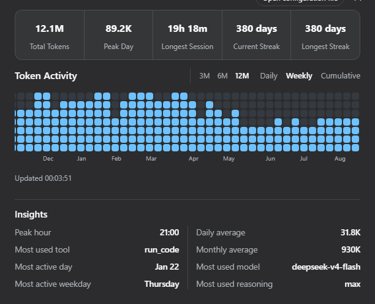
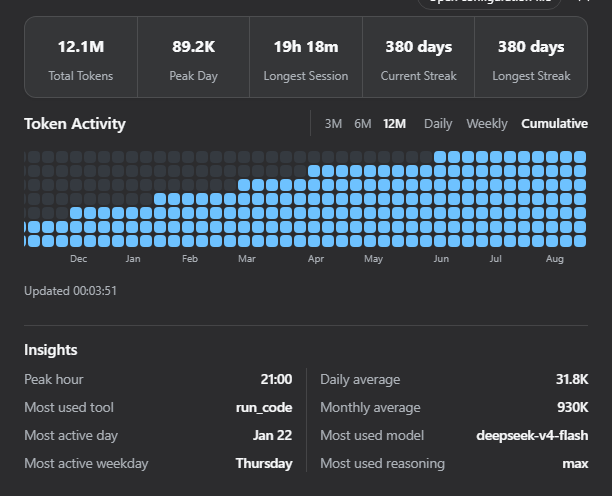
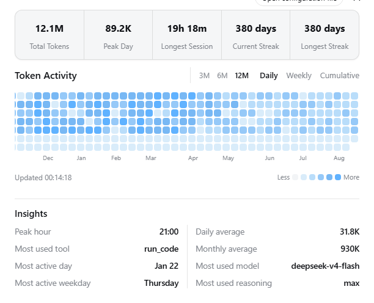

**[English](README.md) | [简体中文](README.zh.md)**

# @kelearns/dsh-token-usage

[](https://www.npmjs.com/package/@kelearns/dsh-token-usage)
[](LICENSE)
[](https://github.com/KeLearns/dsh-token-usage)

Token usage heatmap for the DeepSeek Harness (dsh) web GUI — a GitHub-style
contribution graph for daily / weekly / cumulative token consumption, with a
summary bubble, hover details, and activity insights. Mounted through the
official dsh plugin mechanism (`dsh plugin add`) — no dsh source changes.
Targets the DSH 0.2.0-rc.2 API surface.

A "Token Activity" entry appears in the settings sidebar.

## Screenshots

**Daily heatmap — dark theme, English (12-month window)**


**Three views — dark theme, English**

| Daily | Weekly | Cumulative |
|:---:|:---:|:---:|
|  |  |  |

**Light theme & Chinese UI**

| Light (English) | 深色主题（简体中文） |
|:---:|:---:|
|  |  |

## Features

- **Summary bubble** — one rounded container with 5 statistics divided by
  vertical rules: total / peak-day / longest session / current streak / longest streak;
- **Three views** — Daily (per-day color levels), Weekly (per-week stacked
  cells: week total ÷ (max week / 7) cells, deepest color), Cumulative
  (per-week cumulative stack: total ÷ 7 per cell, newest column always full);
- **Window switch** — last 3 / 6 / 12 months (default 12); fixed 12px cells,
  12-month view scrolls horizontally and auto-scrolls to the latest week;
- **Hover details** — hovering a cell shows that day's total, that week's
  total, or the cumulative total through that day (localized zh/en);
- **Activity insights** — most used model / reasoning effort / tool, peak
  hour, averages per active day / month, most active weekday, most active day;
  activity rankings count recorded calls, not tokens;
  sorted by label length, two equal columns with a continuous center divider;
- **i18n** — zh / en, registered through DSH's locale service;
- **Themes** — light & dark palettes, follows the dsh application theme;
- **Auto refresh** — the page refreshes every 60 seconds; the host checks session revisions every 5 minutes by default;
- **Storage independent** — reads logical session events through DSH's public `SessionPersistence` service, not JSONL files;
- **Cross-platform** — works wherever the DSH web GUI runs; no direct filesystem or compression access.

## Install (official mechanism)

Requires pnpm on PATH:

```powershell
npm install -g pnpm
```

From npm (recommended):

```powershell
dsh plugin --profile web add @kelearns/dsh-token-usage
```

> Listed in [awesome-dsh-plugin](https://github.com/awesome-dsh-plugin/awesome-dsh-plugin) curated registry;
> also searchable as `token-usage` in the **Plugin Market** tab of dsh settings ([dsh-market](https://github.com/dsh-market/dsh-market)).

Local development install (run from this repository's root — `link:.`
resolves to the current directory):

```powershell
dsh plugin --profile web add link:.
```

Remove:

```powershell
dsh plugin --profile web remove @kelearns/dsh-token-usage
```

> The installer reads `cordis.patch.yml` (the `dsh.bundle.patch` manifest
> field) and applies the plugin row automatically — no manual patch editing.
> Restart dsh web to activate.

### Manual equivalent (no CLI)

1. Put the package into the profile node_modules:
   `$DSH_HOME/profiles/web/node_modules/@kelearns/dsh-token-usage`;
2. Append this block to `$DSH_HOME/profiles/web/cordis.patch.yml` (idempotent):

```yaml
- insert:
    - id: dsh-token-usage
      name: '@kelearns/dsh-token-usage'
```

3. Restart dsh web.

## Data source

The plugin uses `ctx.sessionPersistence.list()` and read-only session handles.
DSH selects and migrates the current logical session format before exposing
events, so the plugin does not depend on filenames, compression, or the
configured persistence backend.

Successful model calls contribute `assistant/message.data.usage`; failed or
retried calls contribute the latest usage chunk in `assistant/attempt.data.stream`.
Compaction model calls contribute `compaction/summary.data.usage` when present;
released `assistant/chunk` usage events are also understood. Embedded stream
timestamps are used when available, with the settlement event time as fallback.
Total tokens are input + output + cache-read + cache-write tokens; DSH reports
these four counts as disjoint fields, while reasoning tokens are an output
subset. Insights also read `request/header` and `tool/call`; their averages use
days and months with reported usage.

Per-session folds are cached by DSH's opaque persistence revision. A scan
re-reads only changed sessions. To bound work, it scans at most the 20,000
most recently created sessions and reports when older sessions were omitted.

## Routes (same-origin)

| Method | Path | Description |
|---|---|---|
| GET | /dsh-token-usage/stats | Full statistics: `{ totals, stats, insights, today, days:[{d,i,o,c,w,a}], scan }` |
| POST | /dsh-token-usage/refresh | Force cache invalidation and rescan |
| GET | /dsh-token-usage/status | Cache / last scan state |

## Configuration

```yaml
- insert:
    - id: dsh-token-usage
      name: '@kelearns/dsh-token-usage'
      config:
        refreshIntervalMinutes: 5   # background rescan interval (default 5)
```

## Tests

```powershell
node test/mock.test.mjs                                   # synthetic full pipeline
node test/layout-algo.mjs                                  # layout algorithm matrix
```

## Known limitations

- Sessions with no reported usage contribute no token counts; unreadable sessions are counted in `scan.errors`;
- Days are attributed in the host process's local timezone; weeks start on Monday;
- DSH's `SessionPersistence.list()` is unpaginated; this plugin caps each scan at the 20,000 most recently created sessions and shows a warning when it does;
- The plugin requires the `sessionPersistence` service to be mounted in the Web profile.

## License

MIT
