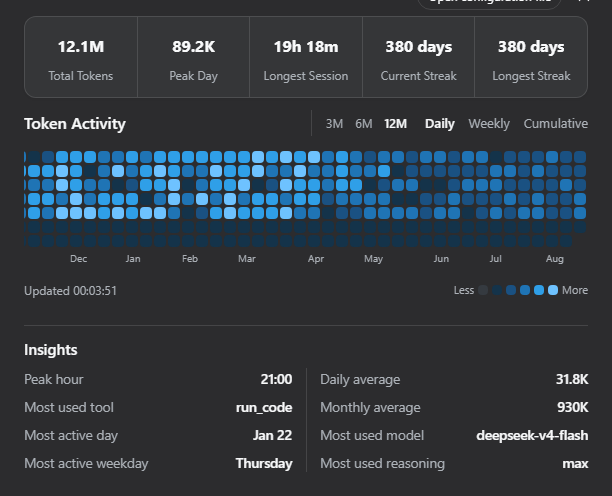

**[English](README.md) | [简体中文](README.zh.md)**

# @kelearns/dsh-token-usage

DeepSeek Harness（dsh）Web GUI 的 Token 用量热力图插件：GitHub 风格贡献图，
统计每日 / 每周 / 累计 token 用量，带汇总气泡、悬停详情与活动洞察。
通过官方插件机制（`dsh plugin add`）挂载，不修改 dsh 本体任何源码。
适配 DSH `0.2.0-rc.2` 的插件 API。

安装后在设置页侧边栏出现「Token 活动」入口。

## 界面预览

**每日热力图 — 深色主题、简体中文（默认 12 个月窗口）**


**三种视图 — 深色主题、简体中文**

| 每日 | 每周 | 累计 |
|:---:|:---:|:---:|
|  |  |  |

**浅色主题与英文界面**

| 浅色主题（简体中文） | Light theme (English) |
|:---:|:---:|
|  |  |

## 功能

- **汇总气泡**：单个圆角容器 + 竖线分割的 5 项统计（累计 / 峰值日 / 最长会话 / 当前连续 / 最长连续天数）；
- **三种视图**：每日（按天分级取色）、每周（周总量 ÷ (最大周/7) 得格数，底部堆叠、统一最深色）、累计（截止各周累计 ÷ (总量/7) 得格数，最新列必满 7 格）；
- **窗口切换**：近 3 / 6 / 12 个月（默认 12）；固定 12px 方格，12 个月横向滚动并自动滚到最新一周；
- **悬停详情**：「M月D日 使用了 X 个 Token」/「当周使用了 X 个 Token」/「截至 X 的已纳入历史累计使用 X 个 Token」；
- **活动洞察**：最常使用的模型 / 推理强度 / 工具、最活跃时段、活跃日均与活跃月均用量、最常用的星期、最活跃的一天；频次按调用次数统计，不按 Token 加权；
- **i18n**：中 / 英文，通过 DSH locale 服务注册并随应用语言切换；
- **主题**：浅色 / 深色双色阶，跟随 DSH 应用主题；
- **自动刷新**：页面每 60 秒更新；host 默认每 5 分钟检查会话 revision，只重读已变化的会话；
- **存储无关**：通过 DSH 公共 `SessionPersistence` 服务读取逻辑事件，不直接扫描文件；
- **跨平台**：适用于 DSH Web GUI 支持的平台，不依赖文件系统或压缩后端。

## 安装（官方机制）

需要 pnpm（确保在 PATH 中）：

```powershell
npm install -g pnpm
```

从 npm 安装（推荐）：

```powershell
dsh plugin --profile web add @kelearns/dsh-token-usage
```

> 已收录于 [awesome-dsh-plugin](https://github.com/awesome-dsh-plugin/awesome-dsh-plugin) 精选目录，
> 也可以在 dsh 设置页的 **Plugin Market**（[dsh-market](https://github.com/dsh-market/dsh-market)）中搜索 `token-usage` 一键安装。

本地开发安装（在仓库根目录执行，`link:.` 解析为当前目录）：

```powershell
dsh plugin --profile web add link:.
```

卸载：

```powershell
dsh plugin --profile web remove @kelearns/dsh-token-usage
```

> 安装器读取包内 `cordis.patch.yml`（`dsh.bundle.patch` 清单字段）自动应用插件行，
> 无需手写 patch。重启 dsh web 后生效。

### 手动等价方式（无 CLI 时）

1. 把包放入 profile 的 node_modules：
   `$DSH_HOME/profiles/web/node_modules/@kelearns/dsh-token-usage`；
2. 在 `$DSH_HOME/profiles/web/cordis.patch.yml` 追加以下块（幂等）：

```yaml
- insert:
    - id: dsh-token-usage
      name: '@kelearns/dsh-token-usage'
```

3. 重启 dsh web。

## 数据来源

插件通过 `ctx.sessionPersistence.list()` 和只读会话句柄读取事件。DSH 负责
选择并迁移逻辑会话格式，因此插件不依赖文件名、压缩格式或具体持久化后端。

成功调用统计 `assistant/message.data.usage`（若缺失则取其 stream 中最后一条
usage）；重试/失败 attempt 统计 `assistant/attempt.data.stream` 的最后一条 usage。
每个 settlement 对应一个已报告的模型调用，因此 attempt 与最终 message 会分别计入。
压缩摘要模型调用在 `compaction/summary.data.usage` 存在时计入；旧版
`assistant/chunk` usage 事件也保留兼容。优先使用 stream 时间戳；没有时使用
settlement 事件时间，并按 host 本地时区归日。

总量 = input + output + cache-read + cache-write。DSH 将这四项作为互斥计数；
`reasoningTokens` 是 output 的子集，不重复加入总量。模型/工具/时段洞察按
事件次数统计；活跃日均与活跃月均只除以有用量的活跃日/月。

会话聚合结果按 DSH 提供的 opaque revision 缓存；扫描只重读变化的会话。为限制
单次工作量，每次最多扫描创建时间最新的 20,000 个会话；有读取失败或更早会话
未扫描时，界面会显示部分统计提示。累计视图按已纳入的全部历史累计，3/6/12 月
选项只改变可见窗口；悬停数值与热力格使用相同的截止当日累计口径。

## 路由（同源）

| 方法 | 路径 | 说明 |
|---|---|---|
| GET | /dsh-token-usage/stats | 全量统计：`{ totals, stats, insights, today, days:[{d,i,o,c,w,a}], scan }` |
| POST | /dsh-token-usage/refresh | 强制失效缓存并重扫 |
| GET | /dsh-token-usage/status | 缓存 / 最近扫描状态 |

## 配置

```yaml
- insert:
    - id: dsh-token-usage
      name: '@kelearns/dsh-token-usage'
      config:
        refreshIntervalMinutes: 5   # 后台重扫间隔（默认 5）
```

## 测试

```powershell
node test/mock.test.mjs                                   # 合成数据全链路
node test/layout-algo.mjs                                  # 排布算法矩阵验证
```

## 已知边界

- 没有 provider usage 的会话不贡献 Token 数，但仍计入已扫描会话数；
- 压缩摘要只在事件包含 `usage` 时计入；
- 时间按 host 本地时区归日；周以周一为一周开始；
- `SessionPersistence.list()` 未分页，插件只纳入创建时间最新的 20,000 个会话，并在界面提示截断；
- 持久化服务不可用时统计接口会返回错误；单个会话读取失败会显示在部分统计提示中。

## License

MIT
